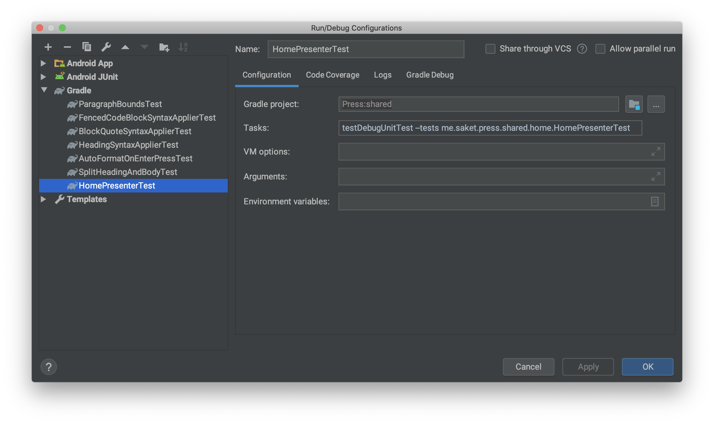

## Testing and Debugging
Press uses fakes for writing tests and avoids mocks because they’re terrible. Assertions are written using [AssertK](https://github.com/willowtreeapps/assertk). Tests that involve storage are run on the JVM so that an in-memory SQL database can be used ([example](https://github.com/saket/Press/blob/trunk/shared/src/commonTest/kotlin/me/saket/press/shared/note/RealNoteRepositoryTest.kt#L20)).

The best way to run the tests right now would be from the command line using `./gradlew shared:testDebug`. They can be run from the Android Studio or IntelliJ IDEA as well, but testing support for multiplatform code from the IDE is a bit flaky right now ([related issue](https://youtrack.jetbrains.com/issue/KT-34535)). An alternative is to manually create run configurations for running custom gradle tasks:



#### Debugging with breakpoints
Debugging of Android code _should_ work as expected. For native code, IntelliJ offers a [plugin](https://plugins.jetbrains.com/plugin/12775-native-debugging-support/) that can be used for debugging with breakpoints. Unfortunately it's only available for IntelliJ Ultimate so it won't work with either Android Studio or the free/community version of IDEA.

#### On mocks vs fakes
Mocks are terrible because they strongly couple tests with their implementation. When  a test is written to check if certain functions on a mocked object were called, the test will be need to be updated every time those functions are refactored.  Here’s an example:

```kotlin
class Adder {
  fun add(a: Int, b: Int): Int = a + b
}

class Calculator(val adder: Adder) {
  fun multiply(number: Int, factor: Int): Int {
    var sum = 0
    repeat(factor) {
      sum = adder.add(sum, number)
    }
    return sum
  }
}

@Test `test multiplication`() {
  val adder = mock(Adder::class)
  val calculator = Calculator(adder)
  calculator.multiply(2, 2)

  verify(adder).add(0, 2)
  verify(adder).add(2, 4)
}
```

Let’s make this worse. What happens if `Adder#add()` is changed to return a `Single<Int>` because we now want to offload additions to a server? 

The test will continue to pass, but the implementation won’t work anymore.  Mocks become worse when we start passing around a “promise” of result instead of the actual result. 

If you’re still unconvinced, Artur Dryomov’s blog post is a good read this subject:
[Superior Testing: Make Fakes not Mocks](https://arturdryomov.dev/posts/superior-testing-make-fakes-not-mocks/)
